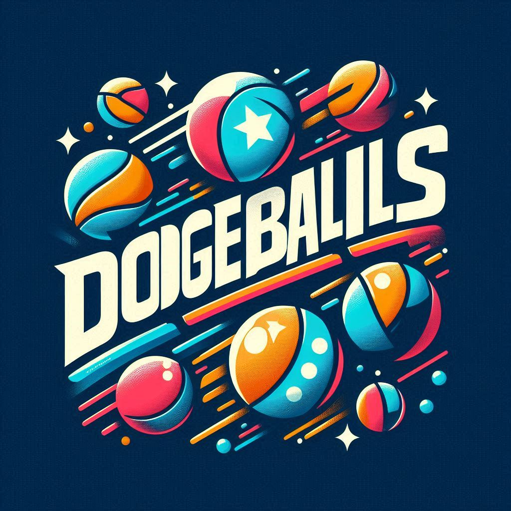

<div align="center">
# DodgeBallers: **thrilling duels to find a hidden ball behind a cup**

Dodgeballers is a blockchain-based game where players, armed with their unique Blobert NFTs, engage in thrilling duels to find a hidden ball behind a cup. Each player receives five chances per round, and the one who wins the most rounds emerges victorious. The game features various modes, challenges, and power-ups to keep players engaged. Traits of the Blobert NFTs, including armor, background, jewelry, mask, and weapon, are gamified to enhance gameplay and strategy. Rewards such as rare items and special NFTs are offered for winning duels, while consequences such as temporary penalties are incurred for losing.


  
  <br />
  <a href="https://github.com/satyambnsal/dodgeballers.git/issues/new?assignees=&labels=bug&template=01_BUG_REPORT.md&title=bug%3A+">Report a Bug</a>
  -
  <a href="https://github.com/satyambnsal/dodgeballers.git/issues/new?assignees=&labels=enhancement&template=02_FEATURE_REQUEST.md&title=feat%3A+">Request a Feature</a>
  -
  <a href="https://github.com/satyambnsal/dodgeballers.git/discussions">Ask a Question</a>
</div>


[](LICENSE)
[](https://github.com/satyambnsal/dodgeballers.git/issues?q=is%3Aissue+is%3Aopen+label%3A%22help+wanted%22)


## What are Blobert

Blobert is the squire of the Realms. Bloberts are onchain blob fish. Their art and metadata are encoded on Starknet and are deterministic based on a Seed


## Getting Started

Install dependencies
```bash
npm install
# or
yarn
```


Run the development server:

```bash
npm run dev
# or
yarn dev
# or
pnpm dev
```
Generate database types
```
supabase gen types typescript --project-id rgxdnnfgcbznmumcdlgp > src/types_db.ts
```

Open [http://localhost:3000](http://localhost:3000) with your browser to see the result.

You can start editing the page by modifying `app/page.tsx`. The page auto-updates as you edit the file.

This project uses [`next/font`](https://nextjs.org/docs/basic-features/font-optimization) to automatically optimize and load Inter, a custom Google Font.


## Contributors ✨

<!-- ALL-CONTRIBUTORS-LIST:START - Do not remove or modify this section -->
<!-- prettier-ignore-start -->
<!-- markdownlint-disable -->

<!-- markdownlint-restore -->
<!-- prettier-ignore-end -->

<!-- ALL-CONTRIBUTORS-LIST:END -->

This project follows the [all-contributors](https://github.com/all-contributors/all-contributors) specification. Contributions of any kind welcome!


## Resources

1. [Blobert dojo jame notion doc](https://organic-fur-4c6.notion.site/Blobert-x-Dojo-Game-Jam-4-2e0a8c5baa544267b624ef7aad1ecd97)
2. Blobert Mainnet contract Address: https://starkscan.co/contract/0x00539f522b29ae9251dbf7443c7a950cf260372e69efab3710a11bf17a9599f1
3. Blobert Website: https://blobert.realms.world/
4. Blobert Code: https://github.com/BibliothecaDAO/codename-bobby-realms
5. Blobert Sepolia Address: https://sepolia.voyager.online/contract/0x02F7b0c38511F8AB906Cf4D686DF7b75a21c37379baE1b79403B75Dae602d60f#readContract
6. Blobert collection Link: https://realms.world/collection/blobert


### Sepolia Contract Addresses 

Blobert code
BlobCloneNFT: 0x0522d9ca1006be983f9106b8a78be9f25f1f493798715d668aec5113ec1b700c

https://sepolia.starkscan.co/contract/0x0522d9ca1006be983f9106b8a78be9f25f1f493798715d668aec5113ec1b700c#overview


Custom Blobert clone 
0x770006531ee20284e2d0eee309f7aad3d9a3a538d125da1aeb0df3956ebda65


### Katana local

account address: 0xb3ff441a68610b30fd5e2abbf3a1548eb6ba6f3559f2862bf2dc757e5828ca


Blobert clone NFT address: 0x34f71e5b6537cf2292d7ccdd49a252fc65e5578ff4d6839916393954145cfbf

Dodgeball contract address
0x505d9f79ea6c2c00e07f3e9dbf7f10c92668f46b95c22d88a39f9a271aad6f1


### Mainnet Contract Addresses


